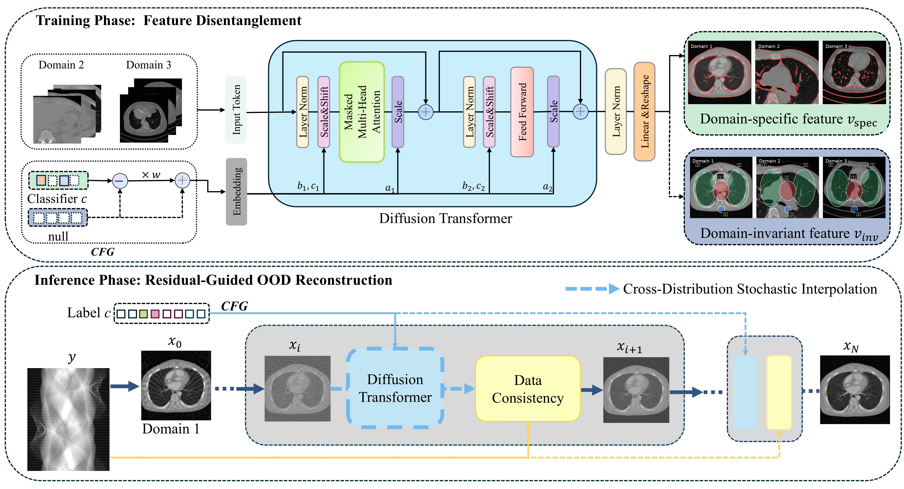

# Cross-Distribution Diffusion Priors-Driven Iterative Reconstruction for Sparse-View CT (CDPIR)

This repo contains PyTorch model definitions, pre-trained weights, and training/sampling code for our TMI paper exploring Cross-Distribution Diffusion Priors-Driven Iterative Reconstruction for Sparse-View CT (CDPIR).

> [**Cross-Distribution Diffusion Priors-Driven Iterative Reconstruction for Sparse-View CT**](https://arxiv.org/pdf/2509.13576)
> 
> [Haodong Li](https://graeme-lee.github.io/haodong/), [Hengyong Yu](https://hengyongyu.wixsite.com/ctlab/untitled-cyjn)
> 
> University of Massachusetts

<p align="center">
  
</p>
<p align="center">
  
</p>

We present Cross-Distribution Diffusion Priors-Driven Iterative Reconstruction (CDPIR) to tackle out-of-distribution (OOD) challenges in Sparse-View CT (SVCT). CDPIR integrates cross-distribution diffusion priors, derived from a Scalable Interpolant Transformer (SiT) backbone, with model-based iterative reconstruction. By establishing a unified stochastic interpolant framework and leveraging Classifier-Free Guidance (CFG), our model learns a highly transferable prior that preserves domain-invariant anatomical structures while allowing domain-specific appearance modulations. By alternating between data fidelity and sampling updates, CDPIR achieves state-of-the-art detail preservation and robustness, significantly outperforming existing approaches in challenging OOD scenarios. 

*This code is modified from [SiT (N Ma, S Xie. et al.)](https://github.com/willisma/SiT).*

---

## 🚀 Get Started

1. **Setup the environment of CDPIR:** We provide an environment.yml file that can be used to create a Conda environment.
```
conda env create -f environment.yml
conda activate cdpir
```
2. **Setup the environment of LEAP:** Install the [LEAP](https://github.com/LLNL/LEAP) projector library. We use [manual](https://github.com/llnl/LEAP/blob/main/manual_install.py) installing based on the [pre-complied files](https://github.com/LLNL/LEAP/wiki/Using-the-LEAP-precompiled-dynamic-libraries). 
3. **Download assets:** Download the [pre-trained ckpt](https://huggingface.co/Hd9955/CDPIR/blob/main/0200000.pt).

> **Note:** By default, the AAPM label is 0, and COCA label is 1 in this pre-trained ckpt file.

## ⚙️ 2D Simulation Reconstruction

Once you have the pre-trained weights and the test data set up properly, you may run the following scripts. Modify the parameters in the python scripts directly to change experimental settings.

```bash
python sample.py SDE 
```
For the raw injection input, you can replace the simulation input projection with a raw projection in the code. 

## ⚙️ CDPIR Training
The training is based on the DiT training. And you can use ODE sampler to test if your training is enough or not.
```bash
python  train.py --model SiT-B/2 --data-path /path/to/imagenet/train
```
## 📑 Citation
If you find our paper helpful, please kindly cite our paper in your publications.
```bash
@misc{li2025crossdistributiondiffusionpriorsdriveniterative,
      title={Cross-Distribution Diffusion Priors-Driven Iterative Reconstruction for Sparse-View CT}, 
      author={Haodong Li and Shuo Han and Haiyang Mao and Yu Shi and Changsheng Fang and Jianjia Zhang and Weiwen Wu and Hengyong Yu},
      year={2025},
      eprint={2509.13576},
      archivePrefix={arXiv},
      primaryClass={eess.IV},
      url={https://arxiv.org/abs/2509.13576}, 
}
```


